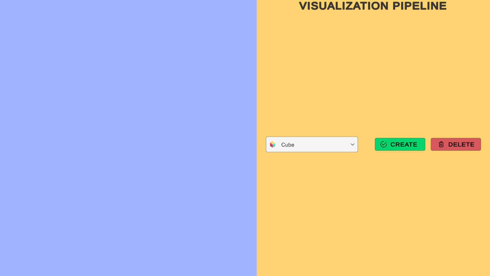
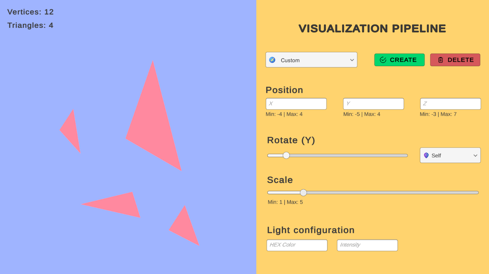
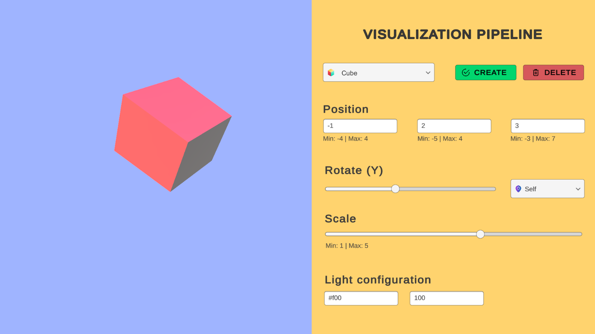
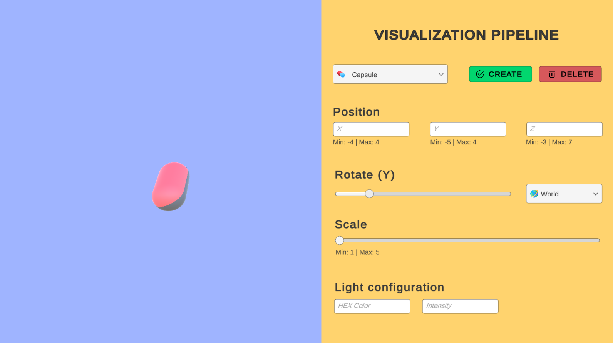

<h1 align="right">
  
  Graphic Computing
</h1>

<p align="right">
Studies and activities of the discipline of Graphic Computing
  <br><br>
  <!-- License -->
  <a>
    
  </a>
</p>
<br>

## :eyes: Overview

### [🖐🏻 Unconventional Game](https://github.com/coetus-jd/unconventional-game)
https://user-images.githubusercontent.com/42717522/172026158-9bb2ade5-2ad0-461b-b84f-c56b84128582.mp4

### [🖼️ Visualization pipeline](https://github.com/coetus-jd/graphic-computing/tree/main/VisualizationPipeline)

<div>
  
  
  
  
</div>

### [🧊 A-Frame](https://github.com/coetus-jd/a-frame-vr)


## :open_book: About 
This project contains some projects and activities from the Graphic Computing discipline in [FATEC Americana](https://www.fatec.edu.br/).

## :bricks: This project was built with: 
- [A-Frame](https://aframe.io/)
- [A-Frame Environment Component](https://github.com/supermedium/aframe-environment-component)
- [Unity](https://unity.com/)
- [Python](https://www.python.org/)
- [OpenCV](https://opencv.org/)
- [Mediapipe](https://mediapipe.dev/)

## 🏄‍♂️ Quick Start
 1. Clone this repository `git clone https://github.com/coetus-jd/graphic-computing.git`
 2. Enter in the project's folder: `cd graphic-computing`
 3. Run whatever project you want 😃
 
## :recycle: Contribute
 1. Fork this repository
 2. Create a branch with your feature: ```git checkout -b my-feature```
 3. Commit your changes: ```git commit -m 'feat: My new feature'```
 4. Push your branch: ```git push origin my-feature```

## :page_with_curl:	License
This project is under the GPL-3.0 license. Take a look at the [LICENSE](LICENSE) file for more details.
